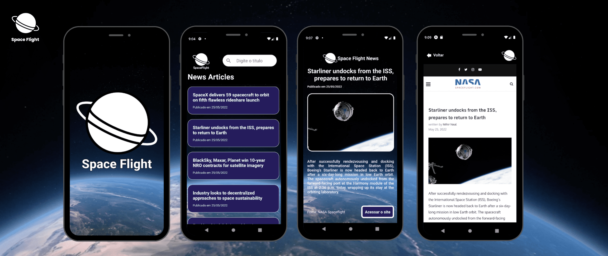

# Space Flight News
## O Space Flight é uma ótima alternativa para quem deseja ficar por dentro de tudo que acontece no espaço. 
Ele fornece noticias atualizadas da industrial aeroespacial do mundo de forma simples e organizada.

<p align="center">

</p>

<h1 align="center">
  🚀Space Flight🚀 
</h1>

<p align="center">
 <a href="#-sobre-o-projeto">Sobre</a> •
 <a href="#-layout">Layout</a> • 
 <a href="#-funcionalidade">Funcionalidades</a> • 	
 <a href="#-tecnologias">Tecnologias</a>  
</p>

---
## Sobre

Obtenha uma visão geral das últimas notícias sobre voos espaciais, de várias fontes!
Space Flight News é a principal fonte de notícias sobre exploração espacial, inovação e astronomia, registrando (e celebrando) a expansão contínua 
da humanidade através da fronteira final. Transportamos nossos visitantes por todo o sistema solar e além por meio de uma cobertura acessível e abrangente das 
últimas notícias e descobertas. 
Para nós, explorar o espaço é tanto sobre a jornada quanto sobre o destino. Então, desde guias de observação do céu e fotos impressionantes do céu noturno até 
lançamentos de foguetes e notícias de última hora sobre sondas robóticas visitando outros planetas, no Space Flight News você encontrará algo incrível todos os dias.


## ⚙Funcionalidades

A aplicação utiliza a API SpaceFlightNews como fonte de dados para exibir as notícias, sendo que a aplicação é constituida de apenas três telas:
Dashboard, exibe todas as noticias utilizando a data de publicação para ordenar a exibição, contendo apenas o título e a data da publicação de cada notícia.
Detalhes da noticia, exibe um resumo da notícia, juntamente com uma imagem da noticia e fonte.
Site da noticia, exibe o próprio site da notícia dentro da aplicação.

---

## 📱Aplicanção
<p align="center">

 </p>
---     

## 🎨Layout

O layout foi fornecido pala Rocketseat 
- [Figma](https://www.figma.com/file/Mhn01yZLPLp0e7q3zoWACf/SpaceFlight?node-id=0%3A1)

  --- 
  
### 🛠Tecnologias Utilizadas

As seguintes ferramentas foram usadas na construção do projeto:

- [TypeScript](https://www.typescriptlang.org/)
- [React Native](https://reactnative.dev/)
- [Styled-components](https://styled-components.com/docs/basics)
- [React-Navigation](https://reactnavigation.org/)
- [Axios](https://axios-http.com/ptbr/docs/intro)

### 🛠Requisitos de software

- Instalar o [yarn](https://yarnpkg.com/)
- Instalar e configurar o [Android Studio](https://developer.android.com/studio)

---

<h1>
  Como utilizar ⚠️
</h1>

 <h3> Para rodar o projeto, basta executar os seguintes comandos, em seu terminal com git <h3/>
 
  
   Faça um clone do repositório
```
  git clone <link-do-repositório>
```
  # Navegue até a pasta do projeto e baixe as dependências<h3/>
```
  cd spaceflight && yarn
```
  # Rode o metro bundler<h3/>
```
  yarn start
```
  # E, em outro terminal, execute
```
  yarn android # ou yarn ios
```  

  
  ## 📝Licença
  <h4> Esse projeto se encontra sob a licença MIT. Para mais informações, acesse o arquivo LICENSE.</h4>

